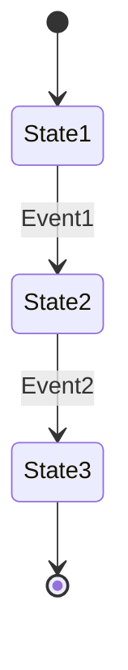
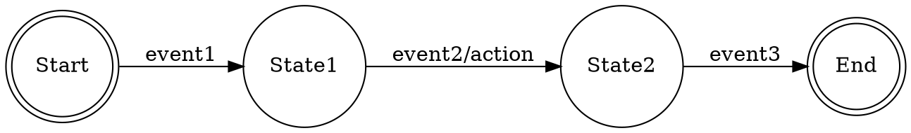

# Finite State Machine Generator

A comprehensive skill for designing, visualizing, and implementing finite state machines (FSMs) across different programming languages and visualization formats.

## Core Capabilities

1. **FSM Design & Modeling**
   - Define states, transitions, and actions
   - Support for Moore, Mealy, and Hierarchical state machines
   - Validation of state machine completeness and determinism
   - Support for guard conditions and transition actions

2. **Visualization Generation**
   - Mermaid diagrams for web-friendly visualization
   - GraphViz/DOT format for professional diagrams
   - State transition tables
   - ASCII art diagrams for documentation

3. **Code Generation**
   - Python implementation with classes or enums
   - TypeScript/JavaScript with proper typing
   - Go implementation with interfaces
   - Java with enum-based state pattern
   - C implementation with switch-case or function pointers

4. **Analysis & Validation**
   - Detect unreachable states
   - Find non-deterministic transitions
   - Identify missing transitions
   - Validate initial and final states

## Input Formats

### 1. Structured Definition (Recommended)

```yaml
name: TrafficLight
type: moore  # moore, mealy, or hierarchical
initial: red
states:
  red:
    output: STOP
    transitions:
      - event: timer_expired
        next: green
  yellow:
    output: CAUTION
    transitions:
      - event: timer_expired
        next: red
  green:
    output: GO
    transitions:
      - event: timer_expired
        next: yellow
```

### 2. Natural Language Description

Describe your state machine in plain text:
- "A vending machine that accepts coins, dispenses products, and returns change"
- "A TCP connection state machine with handshake and teardown"
- "A game character with idle, walking, running, and jumping states"

### 3. Transition Table Format

```
| Current State | Event | Next State | Action |
|--------------|-------|------------|---------|
| Idle | start_button | Running | start_motor() |
| Running | stop_button | Idle | stop_motor() |
| Running | error | Error | log_error() |
| Error | reset | Idle | clear_error() |
```

## Visualization Templates

### Mermaid State Diagram


### GraphViz DOT Format


### ASCII Art Diagram
```
     ┌─────────┐  event1   ┌─────────┐  event2   ┌─────────┐
     │  Start  │ ────────> │ State1  │ ────────> │  End    │
     └─────────┘           └─────────┘           └─────────┘
```

## Code Generation Templates

### Python Implementation Pattern
```python
from enum import Enum, auto
from typing import Dict, Callable, Optional

class State(Enum):
    # States will be generated here
    pass

class StateMachine:
    def __init__(self):
        self.state = State.INITIAL
        self.transitions: Dict = {}
        self._setup_transitions()

    def process_event(self, event: str) -> None:
        # Transition logic
        pass
```

### TypeScript Implementation Pattern
```typescript
enum State {
    // States will be generated here
}

interface Transition {
    from: State;
    event: string;
    to: State;
    action?: () => void;
}

class StateMachine {
    private currentState: State;
    private transitions: Map<string, Transition>;

    constructor() {
        // Initialization
    }

    processEvent(event: string): void {
        // Transition logic
    }
}
```

## Usage Examples

### Example 1: Simple Door Lock FSM
User: "Create a door lock FSM with states: locked, unlocked. Events: insert_key, turn_key, remove_key"

Generated output includes:
- Mermaid visualization
- Python implementation with event handlers
- State transition validation

### Example 2: Complex Protocol Handler
User: "Design a WebSocket connection FSM with handshake, connected, closing, and closed states"

Generated output includes:
- Hierarchical state machine design
- TypeScript implementation with async support
- GraphViz visualization
- Error state handling

### Example 3: Game Character Controller
User: "Build a game character state machine: idle, walking, running, jumping, falling, with physics-based transitions"

Generated output includes:
- Guard conditions for transitions
- Update loop integration code
- Visualization with transition conditions

## Best Practices

1. **State Naming**
   - Use clear, descriptive names (IDLE, PROCESSING, ERROR)
   - Follow language conventions (PascalCase, snake_case)
   - Group related states with prefixes

2. **Transition Management**
   - Always define all possible transitions
   - Include error/fallback states
   - Document guard conditions clearly
   - Log state transitions for debugging

3. **Code Organization**
   - Separate FSM logic from business logic
   - Use dependency injection for actions
   - Make states immutable when possible
   - Include comprehensive tests

4. **Performance Considerations**
   - Use lookup tables for O(1) transition resolution
   - Minimize state entry/exit overhead
   - Consider memory vs. speed tradeoffs
   - Profile state machines in production

## Advanced Features

### Hierarchical State Machines
Support for nested states and state groups:
```yaml
states:
  operational:
    substates:
      - idle
      - working
      - paused
  maintenance:
    substates:
      - cleaning
      - repairing
```

### Guard Conditions
Conditional transitions based on external factors:
```yaml
transitions:
  - from: idle
    to: working
    event: start
    guard: "battery_level > 20"
```

### Parallel States
Support for orthogonal regions:
```yaml
parallel_regions:
  movement: [idle, walking, running]
  combat: [peaceful, attacking, defending]
```

## Common Patterns

1. **Request-Response Pattern**
   - States: Idle → Requesting → Waiting → Processing → Complete
   - With timeout and retry handling

2. **Connection Lifecycle**
   - States: Disconnected → Connecting → Connected → Disconnecting
   - With error recovery

3. **Resource Management**
   - States: Available → Reserved → InUse → Releasing
   - With cleanup actions

4. **Workflow Engine**
   - States: Draft → Submitted → UnderReview → Approved/Rejected
   - With rollback support

## Error Handling

The generator will:
- Identify and report invalid transitions
- Suggest fixes for common FSM design issues
- Provide defensive programming patterns
- Include error recovery states when appropriate

## Testing Support

Generated code includes:
- Unit test templates
- Transition coverage analysis
- State invariant checks
- Event sequence testing
- Property-based testing helpers

## Integration Patterns

### Event-Driven Systems
```javascript
fsm.on('stateChange', (from, to) => {
    eventBus.emit(`state:${to}`, { from, to });
});
```

### Redux/State Management
```typescript
const fsmReducer = (state, action) => {
    return fsm.reduce(state, action.type);
};
```

### Actor Model
```python
class FSMActor:
    def receive(self, message):
        self.fsm.process_event(message.type)
```

## Performance Metrics

The generator provides:
- Complexity analysis (state count, transition density)
- Memory usage estimates
- Transition performance characteristics
- Suggestions for optimization

## Documentation Generation

Automatically creates:
- State machine specification document
- API documentation
- Transition reference table
- Integration guide
- Test coverage report