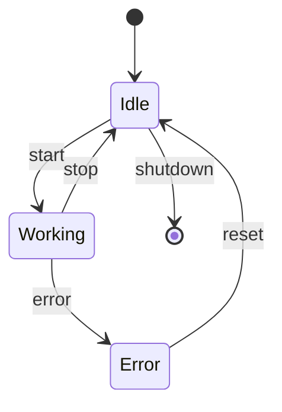
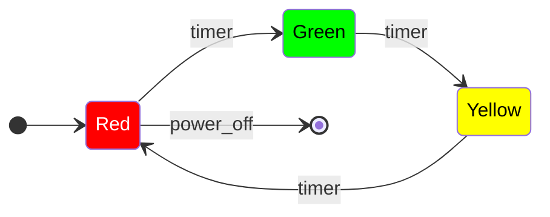
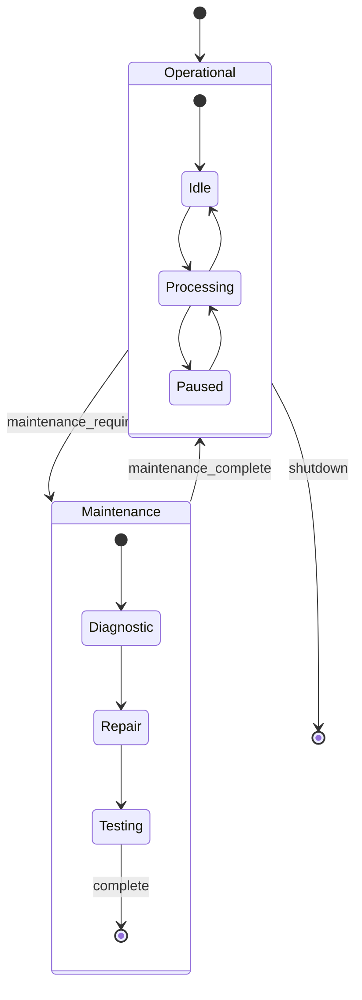
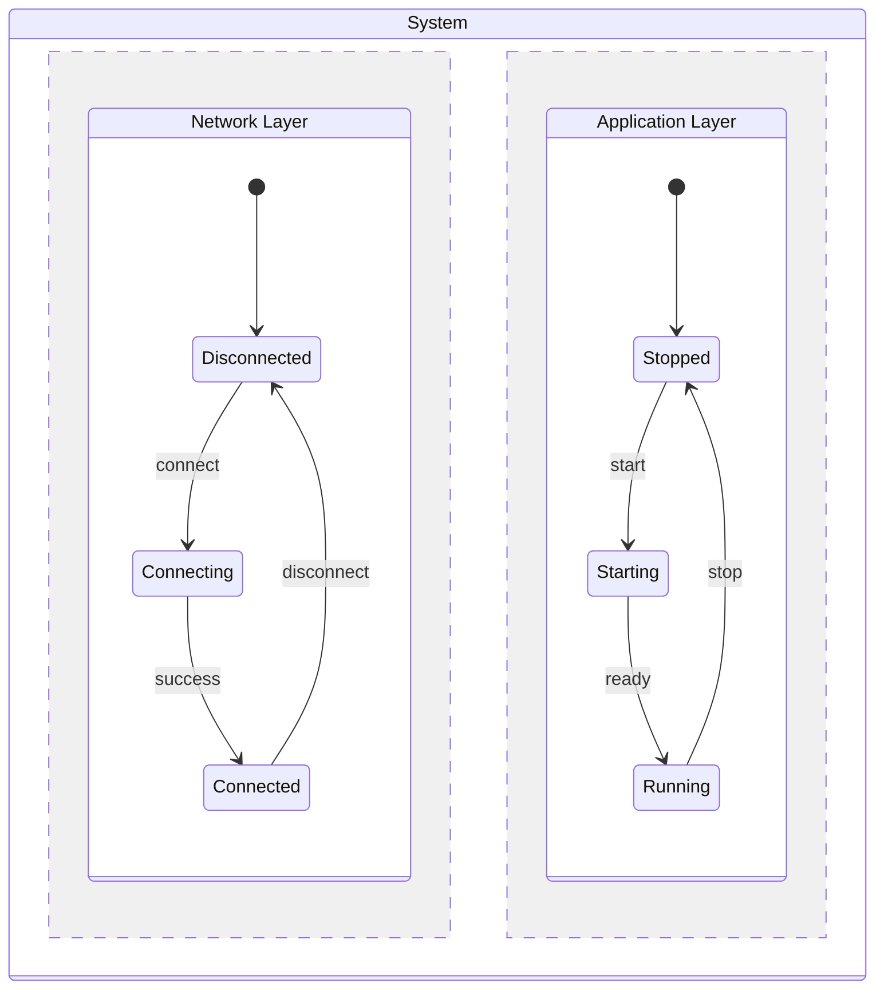
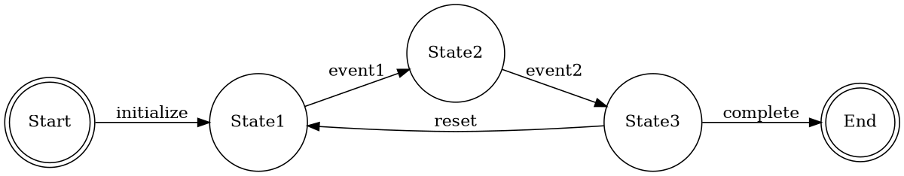
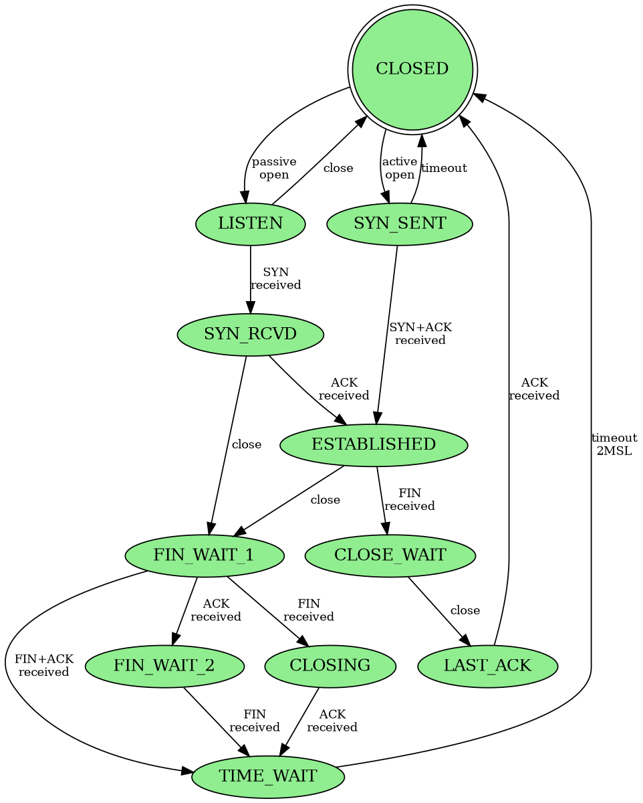
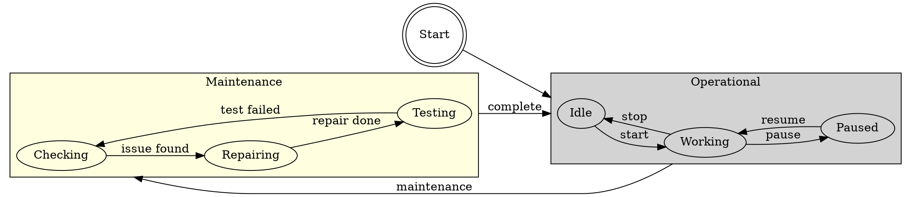
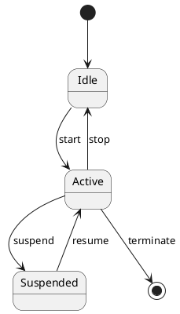
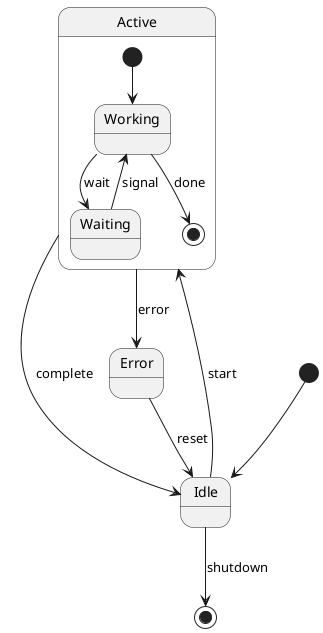

# FSM Visualization Examples

This file demonstrates different visualization formats for finite state machines.

## Mermaid Diagram Examples

### Simple State Machine


### Traffic Light with Styling


### Hierarchical State Machine


### Parallel Regions


## GraphViz DOT Format Examples

### Basic State Machine


### TCP Connection FSM


### Hierarchical States with Subgraphs


## ASCII Art Diagrams

### Simple Linear Flow
```
     ┌─────────┐  start   ┌─────────┐  process  ┌─────────┐  finish  ┌─────────┐
  ●──│  Init   │─────────>│  Ready  │──────────>│ Working │────────>│  Done   │──●
     └─────────┘          └─────────┘           └─────────┘         └─────────┘
```

### Cyclic State Machine
```
                    ┌──────────┐
                    │          │
                    ▼          │ reset
     ┌─────────┐  start  ┌─────────┐  error  ┌─────────┐
  ●──│  Idle   │────────>│ Running │────────>│  Error  │
     └─────────┘         └─────────┘         └─────────┘
          ▲                   │                    │
          │                   │ stop               │ fix
          └───────────────────┴────────────────────┘
```

### Branching State Machine
```
                         ┌─────────────┐
                    ┌───>│  Success    │───┐
                    │    └─────────────┘   │
                    │                       ▼
     ┌─────────┐  run   ┌─────────┐   ┌─────────┐
  ●──│  Start  │───────>│ Process │   │  Done   │──●
     └─────────┘        └─────────┘   └─────────┘
                             │              ▲
                             │              │
                             ▼              │
                        ┌─────────┐        │
                        │  Failed │────────┘
                        └─────────┘ retry
```

## State Transition Tables

### Simple Table Format
```markdown
| Current State | Event | Next State | Action |
|--------------|-------|------------|---------|
| Idle | start | Running | initialize() |
| Running | pause | Paused | save_state() |
| Running | stop | Idle | cleanup() |
| Running | error | Error | log_error() |
| Paused | resume | Running | restore_state() |
| Paused | stop | Idle | cleanup() |
| Error | reset | Idle | clear_error() |
```

### Extended Table with Guards
```markdown
| Current State | Event | Guard Condition | Next State | Action |
|--------------|-------|-----------------|------------|---------|
| Idle | start | battery > 20% | Running | start_motor() |
| Idle | start | battery <= 20% | LowPower | show_warning() |
| Running | speed_change | speed > limit | Warning | reduce_speed() |
| Running | speed_change | speed <= limit | Running | update_display() |
```

## PlantUML State Diagrams

### Basic PlantUML Example


### PlantUML with Composite States


## Code Generation Preview

### Generated from Mermaid
When you provide a Mermaid diagram, the FSM generator can produce:
- State enum/constants
- Transition mappings
- Event handlers
- State machine class

### Generated from YAML
YAML definitions produce:
- Complete implementation with guards
- Action methods
- State entry/exit handlers
- Hierarchical state support

### Generated from Tables
Transition tables generate:
- Lookup-based implementations
- Validation logic
- Test cases for each transition