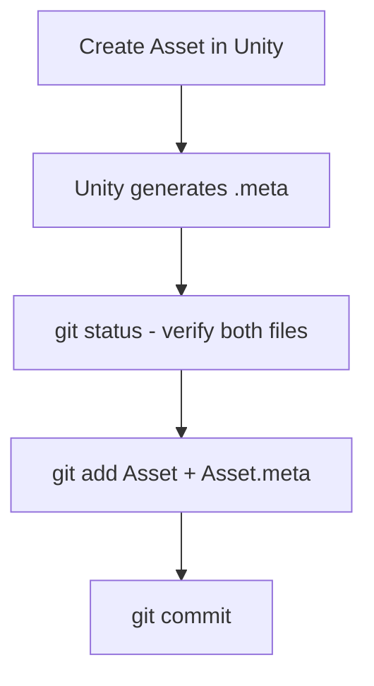

# Unity Project Setup & Best Practices

## Overview

Proper project setup prevents most common Unity errors. This guide covers initial configuration, workflows, and best practices for Unity projects with version control.

## Project Setup Checklist

### Before Starting Development

#### 1. Choose Render Pipeline
- [ ] **Built-in**: Legacy, simple projects
- [ ] **URP**: Modern, cross-platform (recommended)
- [ ] **HDRP**: High-end PC/console only

**If using URP**:
- [ ] Install URP package
- [ ] Create URP asset
- [ ] Assign in Graphics settings
- [ ] Verify renderer configured

→ See `reference/urp-setup.md` for details

#### 2. Configure Input System
- [ ] **Legacy (0)**: Old projects only
- [ ] **New (1)**: New projects with new system
- [ ] **Both (2)**: Migration or compatibility (recommended)

**Location**: Edit → Project Settings → Player → Active Input Handling

**Restart Unity after changing!**

→ See `reference/input-systems.md` for details

#### 3. Set Up Version Control

**Git Configuration**:

Create `.gitignore`:
```gitignore
# Unity generated
/[Ll]ibrary/
/[Tt]emp/
/[Oo]bj/
/[Bb]uild/
/[Bb]uilds/
/[Ll]ogs/
/[Uu]ser[Ss]ettings/

# Asset meta files MUST be tracked
# (Do NOT ignore *.meta files!)

# Visual Studio / VSCode
.vs/
.vscode/
*.csproj
*.unityproj
*.sln
*.suo
*.user
*.userprefs
*.pidb
*.booproj

# OS
.DS_Store
Thumbs.db
```

**Critical**: Keep `.meta` files in version control!

→ See `reference/guid-system.md` for details

#### 4. Configure Editor Settings

**Edit → Preferences**:
- [ ] External Script Editor: Set to VSCode/Rider/Visual Studio
- [ ] Error Pause: Enable for debugging
- [ ] Auto Refresh: Enable

**Edit → Project Settings → Editor**:
- [ ] Asset Serialization Mode: **Force Text** (better for git)
- [ ] Version Control Mode: **Visible Meta Files**

#### 5. Set Up Quality Settings

**Edit → Project Settings → Quality**:
- [ ] Configure quality levels for platforms
- [ ] Set shadow settings
- [ ] Configure anti-aliasing
- [ ] Assign URP asset (if using URP)

#### 6. Configure Physics

**Edit → Project Settings → Physics**:
- [ ] Set up Layer Collision Matrix
- [ ] Configure default solver iterations
- [ ] Set Fixed Timestep (default: 0.02 = 50Hz)

#### 7. Set Up Layers

**Edit → Project Settings → Tags and Layers**:

Common layer structure:
```
Layer 0: Default
Layer 6: Player
Layer 7: Enemy
Layer 8: Bullet
Layer 9: Environment
Layer 10: UI
Layer 11: Ignore Raycast
```

**Configure collision matrix**: Physics → Layer Collision Matrix

---

## Folder Structure

### Recommended Organization

```
Assets/
├── Scenes/
│   ├── MainMenu.unity
│   └── Gameplay.unity
├── Scripts/
│   ├── Player/
│   ├── Enemy/
│   ├── UI/
│   └── Utilities/
├── Prefabs/
│   ├── Characters/
│   ├── Props/
│   └── UI/
├── Materials/
├── Textures/
├── Models/
├── Audio/
│   ├── Music/
│   └── SFX/
├── Animations/
├── Resources/  # For Resources.Load()
│   └── Data/
└── Settings/
    └── URP/ (or HDRP/)
```

### Best Practices

✅ **Do**:
- Organize by feature or content type
- Keep folder names clear and consistent
- Use Resources folder sparingly
- Separate art assets from code

❌ **Don't**:
- Mix unrelated assets in one folder
- Create deep nested hierarchies (>5 levels)
- Put everything in root Assets folder

---

## Git Workflows

### Adding New Assets



**Commands**:
```bash
# Check what's new
git status

# Stage both asset and meta
git add Assets/NewScript.cs
git add Assets/NewScript.cs.meta

# Or stage all new files
git add Assets/

# Commit
git commit -m "Add NewScript"
```

### Deleting Assets

**Via Unity Editor** (Recommended):
1. Delete in Project window
2. Unity removes both files
3. `git status` shows deletions
4. `git add -A` to stage deletions
5. Commit

**Manual deletion**:
```bash
# Delete both files
rm Assets/Scripts/OldScript.cs
rm Assets/Scripts/OldScript.cs.meta

# Stage deletions
git add -A

# Or explicitly
git rm Assets/Scripts/OldScript.cs
git rm Assets/Scripts/OldScript.cs.meta

# Commit
git commit -m "Remove OldScript"
```

### Checking for Issues

```bash
# Find orphaned .meta files
for meta in Assets/**/*.meta; do
    [ -f "${meta%.meta}" ] || echo "Orphaned: $meta"
done

# Find assets without .meta files
find Assets -type f ! -name "*.meta" ! -path "*/.*" | while read file; do
    [ -f "$file.meta" ] || echo "Missing .meta: $file"
done

# Check for untracked .meta files
git status | grep "\.meta$"
```

### Merge Conflicts

#### Scene/Prefab Conflicts

Unity scenes/prefabs are YAML but complex. Merge conflicts can break them.

**Strategy**:
1. **Use Smart Merge** (Unity's tool)
2. **Or choose one version** (theirs or yours)
3. **Or recreate changes manually**

**Unity Smart Merge** (UnityYAMLMerge):
```bash
# Configure git to use Unity's merge tool
# In .git/config or ~/.gitconfig:

[merge]
    tool = unityyamlmerge

[mergetool "unityyamlmerge"]
    trustExitCode = false
    cmd = 'C:\\Program Files\\Unity\\Editor\\Data\\Tools\\UnityYAMLMerge.exe' merge -p "$BASE" "$REMOTE" "$LOCAL" "$MERGED"
```

**Alternative**: Use a staging/prefab variant workflow to avoid conflicts

#### Script Conflicts

Standard git merge works fine for `.cs` files. Resolve conflicts manually.

---

## Asset Naming Conventions

### Files and Assets

| Asset Type | Convention | Example |
|------------|-----------|---------|
| Scripts | PascalCase | `PlayerController.cs` |
| Prefabs | PascalCase | `EnemyGoblin.prefab` |
| Scenes | PascalCase | `MainMenu.unity` |
| Materials | PascalCase_Mat | `Metal_Mat.mat` |
| Textures | PascalCase_Tex | `Brick_Diffuse_Tex.png` |
| Audio | PascalCase | `Explosion_01.wav` |
| Animations | PascalCase_Anim | `Walk_Anim.anim` |

### GameObjects in Scene

- **Descriptive names**: `Player`, `MainCamera`, `EnemySpawner`
- **Hierarchy markers**: Use empty GameObjects as folders
- **Consistent naming**: Follow team conventions

---

## Code Quality Practices

### Script Organization

```csharp
using UnityEngine;
using UnityEngine.InputSystem;  // External
using System.Collections.Generic;  // System

namespace MyGame.Player  // Namespace (optional but recommended)
{
    /// <summary>
    /// Controls player movement and input.
    /// </summary>
    public class PlayerController : MonoBehaviour
    {
        #region Serialized Fields
        [Header("Movement")]
        [SerializeField] private float speed = 5f;
        [SerializeField] private float jumpForce = 10f;

        [Header("References")]
        [SerializeField] private Rigidbody rb;
        #endregion

        #region Private Fields
        private bool isGrounded;
        private Vector3 moveDirection;
        #endregion

        #region Unity Callbacks
        private void Awake()
        {
            // Component caching
        }

        private void Start()
        {
            // Initialization
        }

        private void Update()
        {
            // Input and per-frame logic
        }

        private void FixedUpdate()
        {
            // Physics logic
        }
        #endregion

        #region Public Methods
        public void TakeDamage(int damage)
        {
            // Public interface
        }
        #endregion

        #region Private Methods
        private void HandleMovement()
        {
            // Internal logic
        }
        #endregion
    }
}
```

### Best Practices

✅ **Do**:
- Use `[SerializeField]` instead of public fields
- Add `[Header]` for organization in Inspector
- Cache component references in Awake/Start
- Use descriptive variable names
- Add XML comments for public APIs
- Use regions to organize code (optional)

❌ **Don't**:
- Use `public` fields (use `[SerializeField] private` instead)
- Call `GetComponent` in Update
- Use `GameObject.Find` or `GameObject.FindWithTag` in Update
- Leave unused variables (CS0414 warning)
- Mix initialization code in Update

### Type Hints

Always use type hints:
```csharp
// ✓ Good
private Rigidbody rb;
private PlayerController playerController;
private List<Enemy> enemies;

// ❌ Bad (no type hints)
private var rb;  // Not valid C#, but illustrates point
```

---

## Performance Best Practices

### General Optimization

**Object Pooling**:
```csharp
// Instead of Instantiate/Destroy in loops
public class BulletPool : MonoBehaviour
{
    [SerializeField] private GameObject bulletPrefab;
    private Queue<GameObject> pool = new Queue<GameObject>();

    public GameObject GetBullet()
    {
        if (pool.Count > 0)
        {
            GameObject bullet = pool.Dequeue();
            bullet.SetActive(true);
            return bullet;
        }
        return Instantiate(bulletPrefab);
    }

    public void ReturnBullet(GameObject bullet)
    {
        bullet.SetActive(false);
        pool.Enqueue(bullet);
    }
}
```

**Cache References**:
```csharp
// ❌ Bad - GetComponent every frame
void Update()
{
    GetComponent<Rigidbody>().linearVelocity = Vector3.forward;
}

// ✓ Good - Cache in Awake
private Rigidbody rb;

void Awake()
{
    rb = GetComponent<Rigidbody>();
}

void Update()
{
    rb.linearVelocity = Vector3.forward;
}
```

**Avoid Find in Update**:
```csharp
// ❌ Bad - Find every frame
void Update()
{
    GameObject player = GameObject.FindWithTag("Player");
}

// ✓ Good - Find once
private GameObject player;

void Start()
{
    player = GameObject.FindWithTag("Player");
}
```

### Physics Optimization

- Use simple colliders (box, sphere, capsule)
- Use triggers instead of collisions when possible
- Configure layer collision matrix
- Set objects to sleep when stationary
- Use continuous collision detection only when needed

→ See `reference/physics-system.md` for details

### Rendering Optimization

- Enable Static Batching for static objects
- Use GPU Instancing on materials
- Use LOD (Level of Detail) for complex models
- Limit real-time lights
- Use texture compression
- Optimize shadow settings

→ See `reference/urp-setup.md` for details

---

## Testing and Debugging

### Unity Test Framework

**Install Test Framework**:
- Window → Package Manager → Test Framework → Install

**Create Tests**:
```csharp
using NUnit.Framework;
using UnityEngine;

public class PlayerTests
{
    [Test]
    public void PlayerTakesDamage()
    {
        var player = new GameObject().AddComponent<Player>();
        player.TakeDamage(10);
        Assert.AreEqual(90, player.Health);
    }
}
```

### Profiling

**Window → Analysis → Profiler**

Monitor:
- CPU usage
- Rendering time
- Physics time
- Memory allocations
- GC (Garbage Collection)

---

## Build Settings

### Platform-Specific Settings

**Android**:
- API Level: 24+ (Android 7.0+)
- Scripting Backend: IL2CPP (better performance)
- Target Architectures: ARMv7 + ARM64

**iOS**:
- Target SDK: Latest
- Architecture: ARM64
- Camera Usage Description: Required for camera access

**PC (Windows/Mac/Linux)**:
- API Compatibility: .NET Standard 2.1
- Scripting Backend: Mono (faster builds) or IL2CPP (better runtime)

### Development vs Release

**Development Build**:
- Enable for testing
- Shows profiler stats
- Allows debugger attachment

**Release Build**:
- Disable development build
- Enable optimization
- Strip debug symbols

---

## Project Maintenance

### Regular Tasks

**Weekly**:
- [ ] Run tests
- [ ] Check for Unity updates
- [ ] Review Console warnings
- [ ] Update packages (carefully!)

**Monthly**:
- [ ] Clean unused assets
- [ ] Optimize texture sizes
- [ ] Review performance in Profiler
- [ ] Backup project

**Before Release**:
- [ ] Fix ALL warnings
- [ ] Remove debug code
- [ ] Test on target devices
- [ ] Verify build size
- [ ] Test loading times
- [ ] Profile performance

---

## Migration Checklist

### When Upgrading Unity Version

1. **Backup project** (entire folder + git commit)
2. **Read release notes** (API changes, breaking changes)
3. **Test in new version** (create copy first!)
4. **Fix deprecation warnings**
5. **Test thoroughly** (all features, all platforms)
6. **Update packages** (check compatibility)
7. **Commit changes** (separate from feature work)

### When Switching Render Pipeline

1. **Backup project**
2. **Install new pipeline package**
3. **Create pipeline asset**
4. **Upgrade materials** (automatic tool)
5. **Fix pink materials** (manual shader changes)
6. **Reconfigure lighting**
7. **Test performance**
8. **Fix post-processing** (different systems)

---

## Additional Resources

- [Unity Manual - Project Setup](https://docs.unity3d.com/Manual/CreatingProjects.html)
- [Unity Manual - Version Control](https://docs.unity3d.com/Manual/Versioncontrol.html)
- [Git for Unity](https://thoughtbot.com/blog/how-to-git-with-unity)
- [Unity Best Practices](https://unity.com/how-to/programming-unity)
- [Performance Optimization](https://docs.unity3d.com/Manual/BestPracticeUnderstandingPerformanceInUnity6.html)
